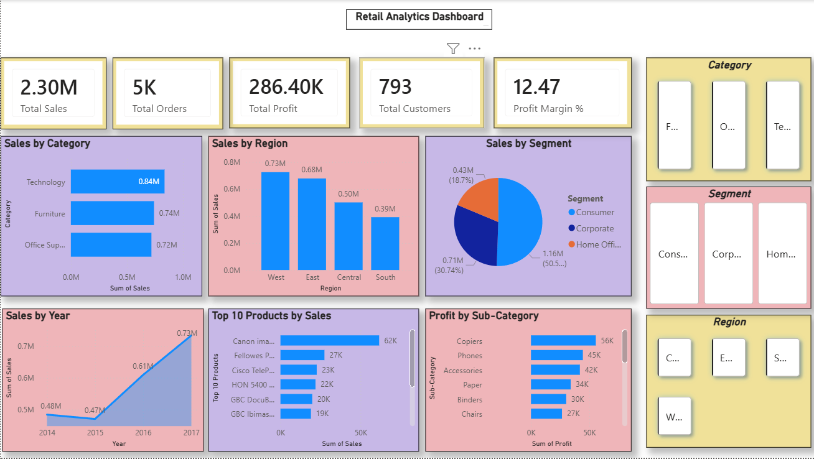

# Retail Analytics Platform

An end-to-end Data Analytics project built using Python, MySQL, and Power BI to analyze retail sales performance, customer behavior, profitability, and business KPIs.

## Project Overview

This project demonstrates a complete analytics workflow:

- Data Cleaning with Python and Pandas
- Data Validation and Quality Checks
- Data Storage and Analysis using MySQL
- Interactive Dashboard Development in Power BI
- Business Insight Generation

## Tech Stack

- Python
- Pandas
- NumPy
- Jupyter Notebook
- MySQL
- Power BI
- Git & GitHub

## Dataset

Sample Superstore Retail Dataset

### Dataset Features

- Orders
- Customers
- Products
- Sales
- Profit
- Discounts
- Regions
- Categories

## Project Structure

```text
Retail-Analytics-Platform/
│
├── dashboards/
│   ├── Retail_Analytics_Dashboard.pbix
│   └── dashboard.png
│
├── data/
│   ├── Superstore.xlsx
│   └── processed/
│       └── clean_superstore.csv
│
├── notebooks/
│   └── 01_data_cleaning.ipynb
│
├── screenshots/
│
├── sql/
│   └── retail_queries.sql
│
├── README.md
├── requirements.txt
└── .gitignore
```

## Data Processing

### Data Cleaning

- Removed missing values
- Validated data types
- Checked duplicates
- Created Month feature
- Exported cleaned dataset

### SQL Analysis

Key analyses performed:

- Total Sales
- Total Profit
- Sales by Category
- Sales by Region
- Customer Analysis
- Product Performance

## Power BI Dashboard

The dashboard includes:

### KPI Cards

- Total Sales
- Total Profit
- Total Orders
- Total Customers
- Profit Margin
- Total Quantity Sold

### Visualizations

- Sales by Category
- Sales by Region
- Monthly Sales Trend
- Top 10 Products by Sales
- Top 10 Customers by Sales
- Profit by Sub-Category
- Sales Distribution by Segment

### Interactive Filters

- Region
- Category
- Segment

## Business Insights

- Technology is one of the strongest revenue-generating categories.
- Sales performance varies significantly across regions.
- Consumer customers contribute a major share of revenue.
- Certain sub-categories generate losses despite strong sales.
- Monthly sales trends help identify seasonal demand patterns.

## Skills Demonstrated

- Data Cleaning
- Exploratory Data Analysis
- SQL Querying
- Data Visualization
- Dashboard Design
- KPI Development
- Business Analytics
- Data Storytelling

## Dashboard Preview




## Author

Shlok Singh

Aspiring Data Analyst | Python | SQL | Power BI | Cloud Computing

GitHub: https://github.com/Shlok1515
